**Je construis des agents IA · étudiant en informatique à Paris (L3 · admis à 42 Paris)**

## 👋 Qui je suis

Longtemps, je savais ce que je voulais construire, mais je n'agissais pas. Le jour où je me suis lancé, mon premier agent vocal refusait de marcher, encore et encore. Puis un post LinkedIn m'a fait découvrir OpenCode, et le même agent a enfin parlé. Depuis, j'en suis convaincu : **l'IA est accessible à tous, avec la bonne méthode et les bons outils.**

## 🧭 Le chemin jusqu'ici

## 🐇 En ce moment : Bunny

Un coach compagnon IA pour le sport et la santé, en forme de lapin qui grandit avec toi. Démo locale, pas encore lancé.

## 🚀 Ce que j'ai construit

| Projet | En une ligne honnête |
|---|---|
| **OwnAI** | Un GPT et son tokenizer BPE recodés de zéro en NumPy : 1 055 488 paramètres, 84 tests. |
| **NEXUS** | Un runtime d'agents en FastAPI, 692 tests verts. Tourne en local, jamais déployé. |
| **AURA** | Hackathon de 48 h, seul : un copilote vocal pour showrooms de mode, 7 agents dont 4 dans la cascade principale. Prototype, jamais déployé. |
| **Agent vocal** | Parler à n'importe quel personnage : Deepgram, GPT-4o-mini, ElevenLabs, Gradio. |
| **Piscine 42** | 26 jours sur 26 à écrire du C à la main, examen final à 87/100 en 8 heures. |
| **QuestLoop** | Le premier projet de mon cousin de 12 ans, fait avec Claude Code. |

## 🛠️ Stack

## 📈 Activité

### 🤝 Tu veux construire avec moi, ou tu cherches un stagiaire en informatique pour avril 2027 ?

**mohamed@buildaitoday.dev** · [buildaitoday.dev](https://buildaitoday.dev)

