


**AI agent builder · CS student in Paris (L3 · admitted to 42 Paris)**

<a href="README.fr.md">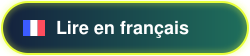</a>


## 👋 Who I am

For a long time I knew what I wanted to build, but I didn't act. The day I started, my first voice agent refused to work, again and again. Then a LinkedIn post led me to OpenCode, and the same agent finally spoke. Since then I'm convinced: **AI is accessible to everyone, with the right method and the right tools.**

🇫🇷 Étudiant en informatique à Paris, je construis des agents IA et je construis Bunny. Je cherche un stage de 3 mois dès avril 2027.

## 🧭 The path so far


## 🐇 Now building: Bunny

An AI companion coach for fitness and health, shaped like a rabbit that grows with you. Local demo, not released yet.

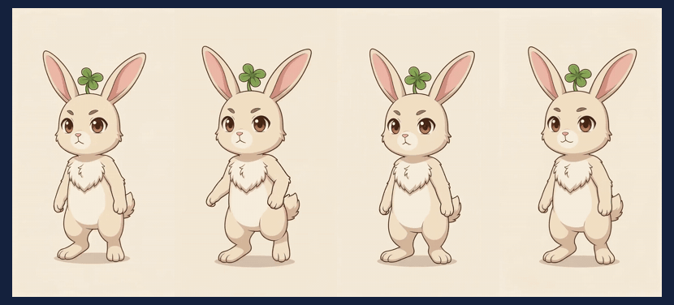
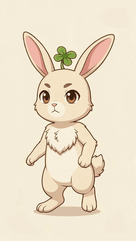

## 🚀 Built, shipped, shared

<a href="https://github.com/Zlarien/OwnAI">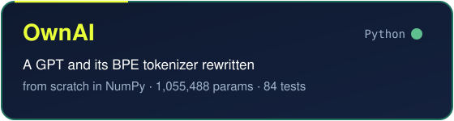</a>
<a href="https://github.com/Zlarien/buildaitoday-dashboard">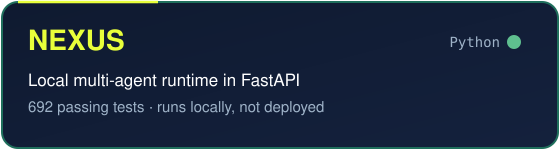</a>
<a href="https://github.com/Zlarien/aura-fashion-ai">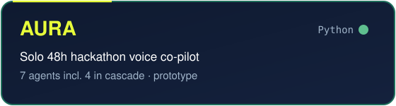</a>
<a href="https://github.com/Zlarien/universal-voice-agent">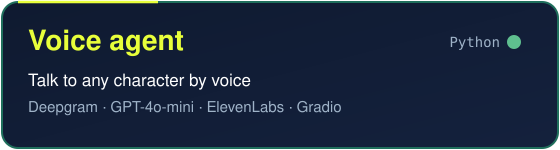</a>
<a href="https://github.com/Zlarien/42ParisPiscineAout2026">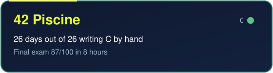</a>
<a href="https://github.com/Zlarien/questloop">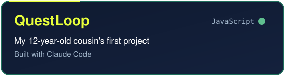</a>

## 🛠️ Stack

## 📈 Momentum

### 🤝 Want to build together, or hiring a CS intern for April 2027?

**mohamed@buildaitoday.dev** · [buildaitoday.dev](https://buildaitoday.dev)

